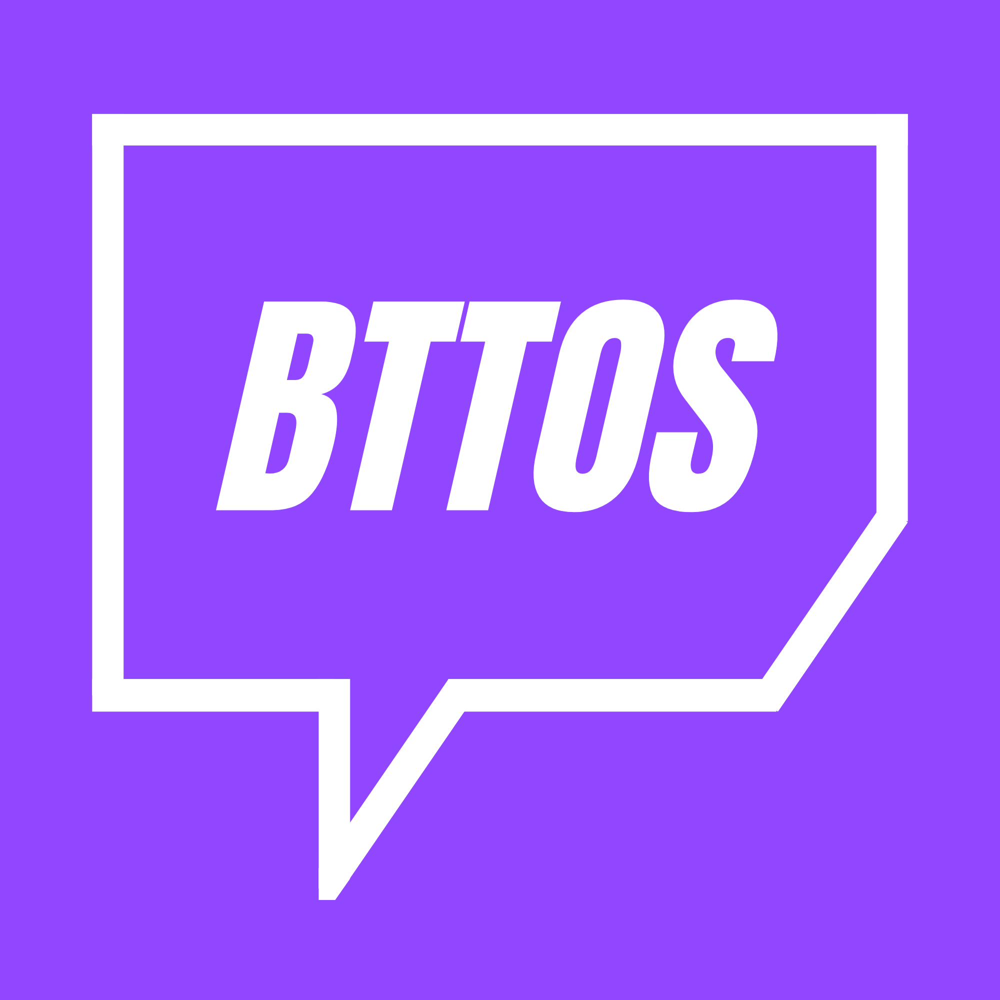

# BTTOS

Alternative Twitch app for WebOS
You need to log in to use the app. It's designed for viewers that just want the stream in the background. For features like chatting, use your phone or computer.

## Features

- Watch Twitch streams only for your followed channels
- 7TV, BTTV, FFZ emotes support
- Scaleable chat
- Left of right side chat
- Auto claim channel points

## Installation

1. Download the latest release from the [releases page](https://github.com/Maxtremee/bttos/releases)
2. Install the app on your WebOS TV using the [webOS CLI](https://webostv.developer.lge.com/develop/tools/cli-introduction) or [webOS Dev Manger](https://github.com/webosbrew/dev-manager-desktop)
3. Open the app and log in with your Twitch account

## Notes

Vibe coded heavily. Twitch's app on WebOS is super laggy so I decided to make my own with a very simple UI and selected features.
